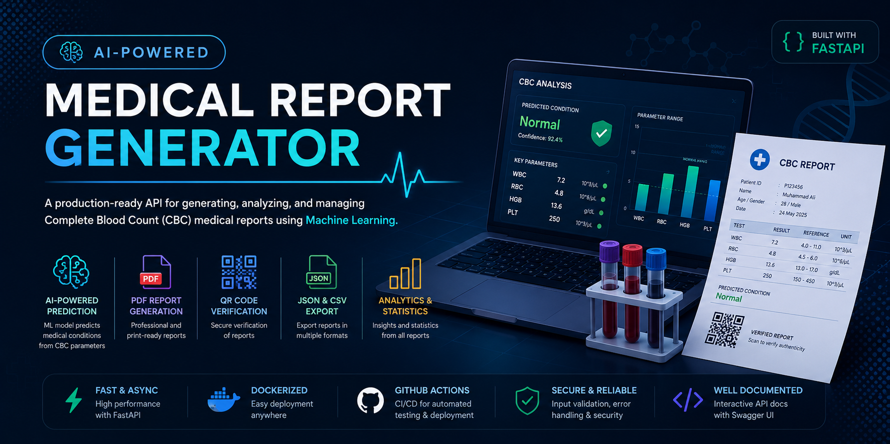
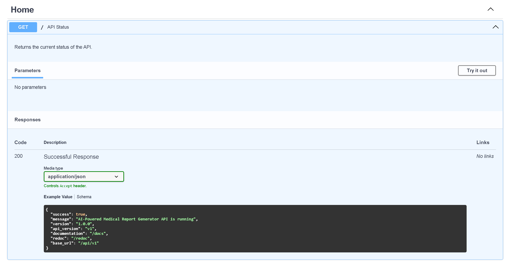
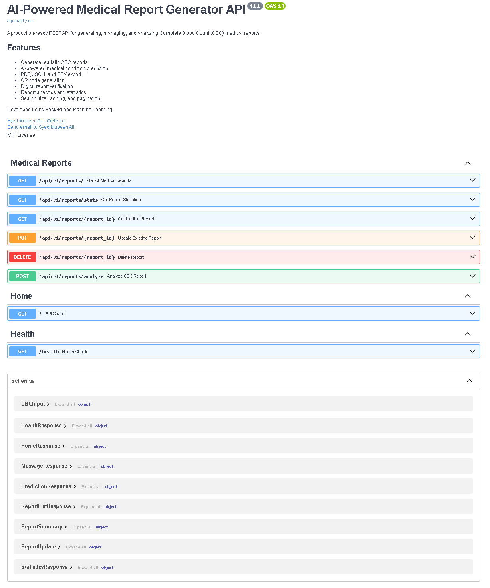
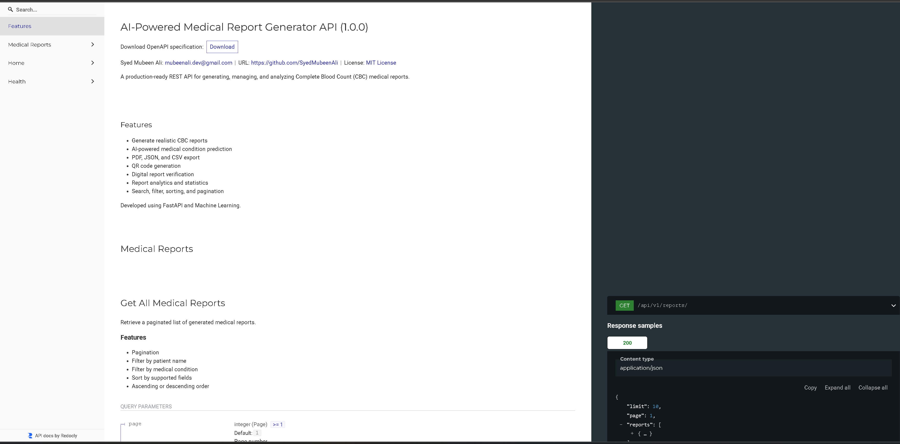
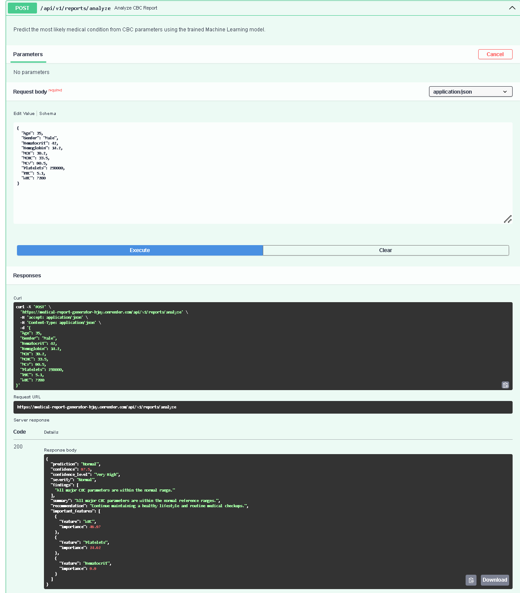
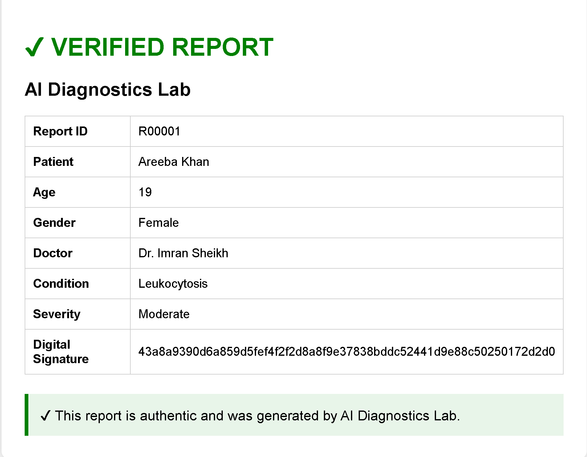

<p align="center">
  
</p>

<h1 align="center">AI-Powered Medical Report Generator</h1>

<p align="center">
A production-ready FastAPI application that generates, analyzes, predicts and verifies Complete Blood Count (CBC) medical reports using Machine Learning.
</p>

<p align="center">


</p>

---

# 🚀 Live Demo

### Production API

https://medical-report-generator-hjuy.onrender.com

### Swagger Documentation

https://medical-report-generator-hjuy.onrender.com/docs

### ReDoc Documentation

https://medical-report-generator-hjuy.onrender.com/redoc

---

# 📖 About The Project

Medical laboratories generate thousands of Complete Blood Count (CBC) reports every day. These reports contain multiple hematological parameters that help physicians identify diseases such as Iron Deficiency, Leukocytosis, Leukopenia, Viral Infection and Thrombocytopenia.

The objective of this project is to automate the generation, management, analysis and verification of CBC reports through a modern REST API built with FastAPI and Machine Learning.

Instead of manually creating reports, the system can automatically generate realistic CBC reports, analyze them using a trained Random Forest model, export reports in multiple formats, generate QR codes for report verification and provide analytics through REST APIs.

The project demonstrates how Artificial Intelligence can be integrated into healthcare software using modern Python technologies and production-ready software engineering practices.

---

# ✨ Features

## 🤖 Artificial Intelligence

- Machine Learning based disease prediction
- Random Forest Classifier
- CBC parameter analysis
- Confidence score generation
- Feature importance support

---

## 📄 Report Generation

- Automatic CBC report generation
- Synthetic patient generation
- Disease-specific CBC values
- Professional report formatting

---

## 📦 Export Support

- PDF Export
- JSON Export
- CSV Export

---

## 🔒 Security

- QR Code verification
- Digital report verification
- Security headers
- Input validation
- Exception handling

---

## 🌐 REST API

- FastAPI
- CRUD Operations
- Pagination
- Filtering
- Sorting
- Interactive Swagger UI
- ReDoc Documentation

---

## 📊 Analytics

- Report statistics
- Dataset analysis
- Charts
- Medical insights

---

## 🧪 Testing

- Pytest
- Automated API testing
- Health endpoint testing
- Prediction testing
- CRUD testing

---

## ⚙ DevOps

- Docker
- GitHub Actions
- Render Deployment
- Production configuration

---

# 🎯 Key Highlights

✔ Production Ready Architecture

✔ Machine Learning Integration

✔ Dockerized Application

✔ RESTful APIs

✔ Interactive API Documentation

✔ QR Code Verification

✔ Multiple Export Formats

✔ Analytics Dashboard Backend

✔ GitHub Actions CI

✔ Automated Testing

---

# 🏗 System Architecture

```text
                           Client Applications
                                   │
        ┌──────────────────────────┼──────────────────────────┐
        │                          │                          │
     Browser                   Swagger UI                 ReDoc
        │                          │                          │
        └──────────────────────────┼──────────────────────────┘
                                   │
                          FastAPI REST API
                                   │
                     ┌─────────────┼─────────────┐
                     │                           │
              Service Layer              AI Prediction
                     │                           │
              Repository Layer          Random Forest
                     │                           │
       JSON • CSV • PDF • QR           Analytics Engine
                     │
             Report Verification
```

---

# 📁 Project Structure

```text
medical-report-generator

│

├── src
│
├── ai
├── analytics
├── api
├── core
├── generators
├── models
├── pdf
├── security
├── verification
│
├── assets
│
├── data
│
├── tests
│
├── Dockerfile
├── requirements.txt
├── README.md
└── .github
```

---

# 🛠 Technology Stack

| Category | Technologies |
|----------|--------------|
| Programming Language | Python 3.13 |
| Backend Framework | FastAPI |
| Machine Learning | Scikit-learn |
| ML Algorithm | Random Forest Classifier |
| Data Processing | Pandas, NumPy |
| PDF Generation | ReportLab |
| QR Code Generation | qrcode |
| API Validation | Pydantic |
| Testing | Pytest |
| Code Quality | Ruff |
| CI/CD | GitHub Actions |
| Deployment | Render |
| Containerization | Docker |

---

# ⚙ Installation

## 1. Clone Repository

```bash
git clone https://github.com/SyedMubeenAli/medical-report-generator.git
```

---

## 2. Navigate to Project

```bash
cd medical-report-generator
```

---

## 3. Create Virtual Environment

### Windows

```bash
python -m venv venv

venv\Scripts\activate
```

### Linux / macOS

```bash
python3 -m venv venv

source venv/bin/activate
```

---

## 4. Install Dependencies

```bash
pip install -r requirements.txt
```

---

## 5. Start Development Server

```bash
uvicorn src.api.main:app --reload
```

Application will start on

```
http://127.0.0.1:8000
```

---

# 🐳 Docker

## Build Docker Image

```bash
docker build -t medical-report-generator .
```

---

## Run Container

```bash
docker run -p 8000:8000 medical-report-generator
```

---

# 📚 API Documentation

After starting the server:

| Documentation | URL |
|--------------|-----|
| Swagger UI | http://127.0.0.1:8000/docs |
| ReDoc | http://127.0.0.1:8000/redoc |

For the deployed application:

| Documentation | URL |
|--------------|-----|
| Live API | https://medical-report-generator-hjuy.onrender.com |
| Swagger UI | https://medical-report-generator-hjuy.onrender.com/docs |
| ReDoc | https://medical-report-generator-hjuy.onrender.com/redoc |

---

# 🌐 API Endpoints

## General

| Method | Endpoint | Description |
|--------|----------|-------------|
| GET | `/` | API Status |
| GET | `/health` | Health Check |

---

## Reports

| Method | Endpoint | Description |
|--------|----------|-------------|
| GET | `/api/v1/reports` | Retrieve all reports |
| GET | `/api/v1/reports/{report_id}` | Retrieve report by ID |
| PUT | `/api/v1/reports/{report_id}` | Update report |
| DELETE | `/api/v1/reports/{report_id}` | Delete report |
| POST | `/api/v1/reports/analyze` | Generate AI prediction |

---

# 🤖 Machine Learning Pipeline

The prediction engine uses a trained **Random Forest Classifier** to analyze CBC values and estimate the most probable medical condition.

### Workflow

```
CBC Parameters

↓

Data Validation

↓

Feature Preprocessing

↓

Random Forest Model

↓

Prediction

↓

Confidence Score

↓

Medical Explanation

↓

REST API Response
```

The trained model is loaded during runtime and integrated directly with the FastAPI application to provide real-time predictions.

---

# 📊 Report Analytics

The analytics module provides useful insights including:

- Dataset statistics
- CBC distribution analysis
- Feature visualization
- Export analysis
- Summary statistics

This makes the project useful not only for report generation but also for understanding medical datasets.

---

# 🔐 Security Features

The project includes multiple security mechanisms:

- Security Headers Middleware
- Exception Handling
- Request Logging Middleware
- Pydantic Validation
- QR Code Verification
- Report Integrity Validation

---

# 🧪 Testing

Run all tests:

```bash
pytest -v
```

The test suite validates:

- API Health Endpoint
- Report APIs
- AI Prediction
- CRUD Operations
- Update & Delete Operations

GitHub Actions automatically executes the test suite for every push and pull request.

---

# 📸 Project Screenshots

The following screenshots showcase the key features and functionality of the AI-Powered Medical Report Generator.

---

## 🏠 Home Endpoint

The home endpoint provides the API status, version information, and quick links to the available documentation.

<p align="center">
  
</p>

---

## 📘 Swagger UI

Interactive API documentation generated automatically by FastAPI, allowing users to test every endpoint directly from the browser.

<p align="center">
  
</p>

---

## 📖 ReDoc Documentation

Clean and structured API reference with detailed endpoint descriptions, request models, and response schemas.

<p align="center">
  
</p>

---

## 🤖 AI Medical Condition Prediction

The Machine Learning model analyzes CBC parameters and predicts the most likely medical condition along with confidence score, findings, recommendations, and feature importance.

<p align="center">
  
</p>

---

## ✅ Digital Report Verification

Each generated medical report contains a unique QR code. Scanning the QR code opens a verification page where the report authenticity, patient details, and digital signature can be verified.

<p align="center">
  
</p>

---

# 🚀 Deployment

The application is deployed on **Render** and is publicly accessible.

| Service | Link |
|---------|------|
| Live Application | https://medical-report-generator-hjuy.onrender.com |
| Swagger UI | https://medical-report-generator-hjuy.onrender.com/docs |
| ReDoc | https://medical-report-generator-hjuy.onrender.com/redoc |

---

# 🔄 CI/CD

Continuous Integration is configured using **GitHub Actions**.

For every push or pull request, the workflow automatically:

- Installs project dependencies
- Checks code quality using Ruff
- Runs the complete Pytest test suite
- Verifies project integrity before deployment

This helps maintain code quality and prevents regressions.

---

# 📈 Future Improvements

Although the current version is production-ready, several enhancements can be added in future releases.

- User Authentication & Authorization
- JWT-based Secure APIs
- PostgreSQL Integration
- Report History Dashboard
- Doctor & Patient Portals
- Role-Based Access Control (RBAC)
- Email Report Delivery
- Cloud Storage Integration
- Medical Image Analysis
- Additional Blood Test Support
- Explainable AI (XAI)
- Multi-language Support

---

# 🤝 Contributing

Contributions are welcome.

If you would like to improve this project:

1. Fork the repository.
2. Create a new feature branch.

```bash
git checkout -b feature/new-feature
```

3. Commit your changes.

```bash
git commit -m "Add new feature"
```

4. Push your branch.

```bash
git push origin feature/new-feature
```

5. Open a Pull Request.

Please ensure that your code follows the project's coding standards and passes all tests before submitting.

---

# 📄 License

This project is licensed under the MIT License.

You are free to use, modify, and distribute this project in accordance with the terms of the license.

---

# 👨‍💻 Author

**Syed Mubeen Ali**

AI Engineer | Machine Learning Enthusiast | Backend Developer

GitHub

https://github.com/SyedMubeenAli

LinkedIn

https://www.linkedin.com/in/syedmubeenali2k17/

---

# ⭐ Support

If you found this project useful, consider giving it a ⭐ on GitHub.

Your support helps increase the visibility of the project and motivates further development.

---

# 🙏 Acknowledgements

This project was built using several outstanding open-source technologies.

Special thanks to the communities behind:

- FastAPI
- Scikit-learn
- Pandas
- NumPy
- ReportLab
- Pydantic
- Docker
- Pytest
- GitHub Actions
- Render

Their tools and documentation made this project possible.

---

<p align="center">

Made with ❤️ using Python, FastAPI and Machine Learning

</p>